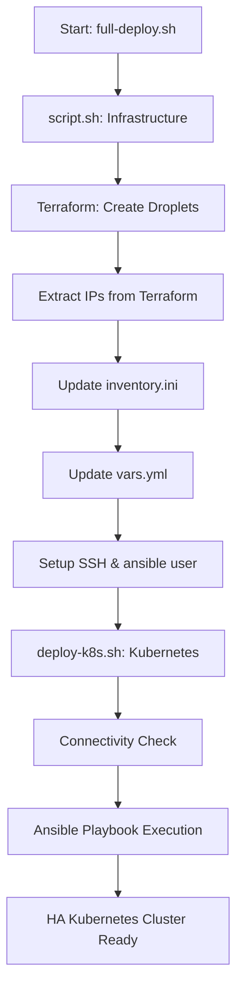

# Deployment Workflow & Technical Details

## 🔄 Complete Deployment Flow



## 📋 Ansible Playbook Execution Order

The `deploy.yml` orchestrates the following sequence:

### 1. Base System Setup
```yaml
- playbooks/01-base-setup/main.yml     # System updates, packages
- playbooks/01-base-setup/kernel.yml   # Kernel parameters for K8s
```

### 2. Container Runtime
```yaml  
- playbooks/02-runtime/containerd.yml  # Install & configure containerd
- playbooks/02-runtime/cri-tools.yml   # Install crictl tools
```

### 3. Kubernetes Installation
```yaml
- playbooks/03-kubernetes/install.yml   # Install kubeadm, kubelet, kubectl
- playbooks/03-kubernetes/configure.yml # Configure Kubernetes settings
```

### 4. HA Setup (Critical Order)
```yaml
- playbooks/04-ha-setup/lb.yml          # Configure HAProxy load balancer
- playbooks/04-ha-setup/master-init.yml # Initialize first master
- playbooks/06-network/cni.yml          # Install Calico CNI
- playbooks/04-ha-setup/join-masters.yml # Join additional masters
```

### 5. Worker Nodes
```yaml
- playbooks/05-workers/join-workers.yml # Join worker nodes
```

## 🎯 Script Design Decisions

### Why Separate Scripts?

| Script | Purpose | Benefits |
|--------|---------|----------|
| `script.sh` | Infrastructure + Config | • Clear separation of concerns<br>• Can retry infrastructure independently<br>• Config updates visible |
| `deploy-k8s.sh` | Kubernetes Deployment | • Can retry K8s deployment independently<br>• Validates prerequisites<br>• Clear deployment feedback |
| `full-deploy.sh` | End-to-End Automation | • Beginner-friendly<br>• Production pipeline ready<br>• Single command deployment |

### Dynamic Configuration Approach

**Problem**: Hardcoded IPs break automation and aren't learner-friendly

**Solution**: Dynamic updates via Terraform outputs
```bash
# Extract IPs dynamically
lb_ip=$(terraform output -raw lb_ip)
master_ips=($(terraform output -json | jq -r '.master_ips.value[]'))

# Update Ansible files automatically
sed -i "s/lb_ip: \".*\"/lb_ip: \"$lb_ip\"/" vars.yml
```

**Benefits**:
- ✅ No manual IP configuration
- ✅ Works with any cloud provider
- ✅ Reduces human error
- ✅ Fully automated pipeline

## 🔧 Infrastructure Components

### Terraform Resources Created
```hcl
# Load Balancer
resource "digitalocean_droplet" "lb"

# Master Nodes (3x)
resource "digitalocean_droplet" "masters"

# Worker Nodes (2x) 
resource "digitalocean_droplet" "workers"

# SSH Key
resource "digitalocean_ssh_key" "default"
```

### Network Configuration
- **Pod Network**: `192.168.0.0/16` (Calico)
- **Service Network**: `10.96.0.0/12` (Kubernetes default)
- **API Server**: Load balanced across all masters
- **CNI**: Calico with BGP routing

## 🚀 Deployment Timeline

| Phase | Duration | Activities |
|-------|----------|------------|
| Infrastructure | 2-3 min | Terraform creates droplets |
| SSH Setup | 1-2 min | Configure ansible user on all nodes |
| Base Setup | 3-5 min | System updates, kernel config |
| Container Runtime | 2-3 min | Install containerd, CRI tools |
| Kubernetes Install | 3-4 min | Install K8s components |
| HA Configuration | 5-7 min | Setup LB, init masters, CNI |
| Worker Join | 2-3 min | Join workers to cluster |
| **Total** | **18-27 min** | **Complete HA cluster** |

## 🔍 Verification Steps

### After Infrastructure (`script.sh`)
```bash
# Check Terraform outputs
cd terrform && terraform output

# Verify inventory file
cat ha-k8s-ansible/inventory.ini

# Test SSH connectivity
ssh ansible@<any-node-ip>
```

### After Deployment (`deploy-k8s.sh`)
```bash
# SSH to master node
ssh ansible@<master-ip>

# Check cluster status
kubectl get nodes -o wide
kubectl get pods --all-namespaces
kubectl cluster-info

# Verify HA
kubectl get endpoints kubernetes
```

## 🛡️ Security Considerations

### SSH Security
- Uses SSH key authentication (no passwords)
- Dedicated `ansible` user with sudo access
- SSH keys copied from root to ansible user

### Kubernetes Security
- RBAC enabled by default
- Network policies via Calico
- Secure communication between components
- Regular security updates in base playbooks

### Production Enhancements (TODO)
- [ ] Certificate management with cert-manager
- [ ] Secrets management with external secrets
- [ ] Network policy enforcement
- [ ] RBAC fine-tuning
- [ ] Audit logging configuration

## 🎓 Educational Value

### What Learners Will Understand
1. **Infrastructure as Code**: Terraform patterns
2. **Configuration Management**: Ansible best practices  
3. **Kubernetes Architecture**: HA setup, networking
4. **Automation**: Script composition and error handling
5. **Cloud Operations**: DigitalOcean droplet management

### Customization Points
```bash
# Easy version updates
vim ha-k8s-ansible/vars.yml

# Modify cluster size
vim terrform/variables.tf

# Add custom playbooks
vim ha-k8s-ansible/deploy.yml
```

## 🔄 CI/CD Integration

### GitHub Actions Example
```yaml
name: Deploy HA K8s Cluster
on: [workflow_dispatch]
jobs:
  deploy:
    runs-on: ubuntu-latest
    steps:
      - uses: actions/checkout@v3
      - name: Deploy Cluster
        env:
          DO_TOKEN: ${{ secrets.DO_TOKEN }}
        run: ./full-deploy.sh
```

### Production Pipeline
1. **Development**: Use `script.sh` + `deploy-k8s.sh` for testing
2. **Staging**: Use `full-deploy.sh` for integration testing  
3. **Production**: Customize with additional validation steps

---

**This approach balances simplicity for learners with power for production use.**
